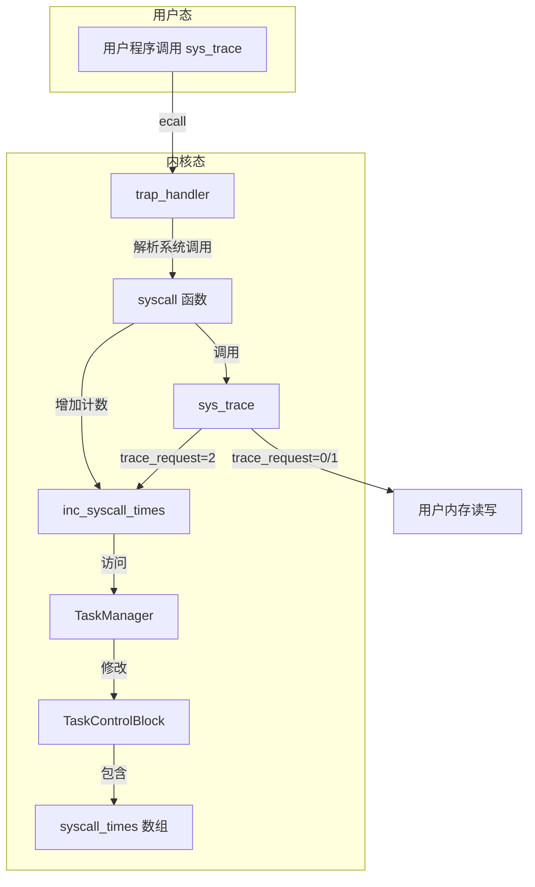

# Lab1: sys_trace 系统调用实现方案

## 任务概述

在 ch3 中实现一个新的系统调用 `sys_trace`（ID 为 410），用于追踪当前任务系统调用的历史信息。

## 系统调用规范

```rust
fn sys_trace(trace_request: usize, id: usize, data: usize) -> isize
```

| trace_request | 功能 | 返回值 |
|---------------|------|--------|
| 0 | 读取 id 地址处一个字节的值 | id 地址处的值 |
| 1 | 写入 data（作为 u8）到 id 地址处 | 0 |
| 2 | 查询编号为 id 的系统调用次数 | 调用次数 |
| 其他 | 无效请求 | -1 |

## 实现方案

### 1. 修改 TaskControlBlock 结构体

在 [`os/src/task/task.rs`](os/src/task/task.rs) 中，为 `TaskControlBlock` 添加系统调用计数器数组：

```rust
use crate::config::MAX_APP_NUM;

/// 系统调用编号的最大值（用于计数器数组大小）
const MAX_SYSCALL_NUM: usize = 500;

/// The task control block (TCB) of a task.
#[derive(Copy, Clone)]
pub struct TaskControlBlock {
    /// The task status in it's lifecycle
    pub task_status: TaskStatus,
    /// The task context
    pub task_cx: TaskContext,
    /// 系统调用计数器，记录每个系统调用的调用次数
    pub syscall_times: [u32; MAX_SYSCALL_NUM],
}
```

### 2. 修改 TaskManager 添加访问方法

在 [`os/src/task/mod.rs`](os/src/task/mod.rs) 中，添加获取和修改当前任务系统调用计数的方法：

```rust
impl TaskManager {
    /// 获取当前任务的系统调用计数
    fn get_syscall_times(&self, syscall_id: usize) -> u32 {
        let inner = self.inner.exclusive_access();
        let current = inner.current_task;
        inner.tasks[current].syscall_times[syscall_id]
    }

    /// 增加当前任务指定系统调用的计数
    fn inc_syscall_times(&self, syscall_id: usize) {
        let mut inner = self.inner.exclusive_access();
        let current = inner.current_task;
        inner.tasks[current].syscall_times[syscall_id] += 1;
    }
}

/// 获取当前任务的系统调用计数
pub fn get_syscall_times(syscall_id: usize) -> u32 {
    TASK_MANAGER.get_syscall_times(syscall_id)
}

/// 增加当前任务指定系统调用的计数
pub fn inc_syscall_times(syscall_id: usize) {
    TASK_MANAGER.inc_syscall_times(syscall_id);
}
```

同时需要修改 `TASK_MANAGER` 的初始化，将 `syscall_times` 初始化为全 0：

```rust
lazy_static! {
    pub static ref TASK_MANAGER: TaskManager = {
        let num_app = get_num_app();
        let mut tasks = [TaskControlBlock {
            task_cx: TaskContext::zero_init(),
            task_status: TaskStatus::UnInit,
            syscall_times: [0; MAX_SYSCALL_NUM],
        }; MAX_APP_NUM];
        // ... 其余初始化代码
    };
}
```

### 3. 修改 syscall 函数统计调用次数

在 [`os/src/syscall/mod.rs`](os/src/syscall/mod.rs) 中，修改 `syscall` 函数：

```rust
use crate::task::{get_syscall_times, inc_syscall_times};

/// handle syscall exception with `syscall_id` and other arguments
pub fn syscall(syscall_id: usize, args: [usize; 3]) -> isize {
    // 增加系统调用计数（在处理之前计数，这样 trace 本身也会被统计）
    inc_syscall_times(syscall_id);
    
    match syscall_id {
        SYSCALL_WRITE => sys_write(args[0], args[1] as *const u8, args[2]),
        SYSCALL_EXIT => sys_exit(args[0] as i32),
        SYSCALL_YIELD => sys_yield(),
        SYSCALL_GET_TIME => sys_get_time(args[0] as *mut TimeVal, args[1]),
        SYSCALL_TRACE => sys_trace(args[0], args[1], args[2]),
        _ => panic!("Unsupported syscall_id: {}", syscall_id),
    }
}
```

### 4. 实现 sys_trace 系统调用

在 [`os/src/syscall/process.rs`](os/src/syscall/process.rs) 中，实现完整的 `sys_trace`：

```rust
use crate::task::get_syscall_times;

/// trace syscall - 追踪系统调用信息
/// 
/// - trace_request = 0: 读取 id 地址处一个字节的值
/// - trace_request = 1: 写入 data（作为 u8）到 id 地址处
/// - trace_request = 2: 查询编号为 id 的系统调用次数
pub fn sys_trace(trace_request: usize, id: usize, data: usize) -> isize {
    trace!("kernel: sys_trace");
    match trace_request {
        0 => {
            // 读取 id 地址处一个字节
            let ptr = id as *const u8;
            unsafe { *ptr as isize }
        }
        1 => {
            // 写入 data（作为 u8）到 id 地址处
            let ptr = id as *mut u8;
            unsafe { *ptr = data as u8; }
            0
        }
        2 => {
            // 查询编号为 id 的系统调用次数
            get_syscall_times(id) as isize
        }
        _ => -1,
    }
}
```

## 文件修改清单

| 文件 | 修改内容 |
|------|----------|
| [`os/src/task/task.rs`](os/src/task/task.rs) | 添加 `syscall_times` 字段到 `TaskControlBlock` |
| [`os/src/task/mod.rs`](os/src/task/mod.rs) | 添加 `get_syscall_times` 和 `inc_syscall_times` 方法，修改初始化代码 |
| [`os/src/syscall/mod.rs`](os/src/syscall/mod.rs) | 在 `syscall` 函数中添加计数逻辑 |
| [`os/src/syscall/process.rs`](os/src/syscall/process.rs) | 实现完整的 `sys_trace` 函数 |

## 架构图



## 测试验证

使用 `make run BASE=0` 编译并运行实验测例，验证：
1. `sys_trace(0, addr, _)` 能正确读取用户态内存
2. `sys_trace(1, addr, data)` 能正确写入用户态内存
3. `sys_trace(2, syscall_id, _)` 能正确返回系统调用次数
4. 无效的 `trace_request` 返回 -1

## 注意事项

1. **不安全操作**：`sys_trace` 的读写操作使用 `unsafe` 块，这是因为在 ch3 阶段还没有实现地址空间隔离，不需要进行安全检查。

2. **计数时机**：系统调用计数应该在 `syscall` 函数入口处进行，这样 `sys_trace` 本身的调用也会被统计。

3. **数组大小**：`MAX_SYSCALL_NUM` 设置为 500，足以覆盖当前使用的系统调用编号（最大为 410）。

4. **类型转换**：注意 `u32` 到 `isize` 的转换，确保返回值类型正确。